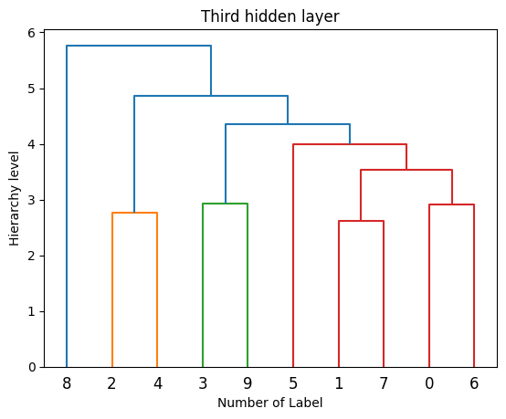
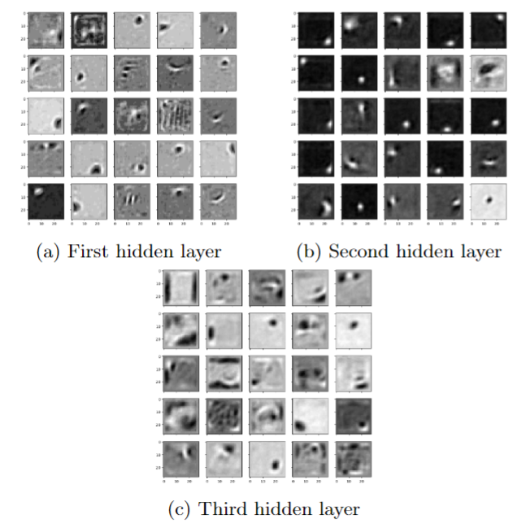
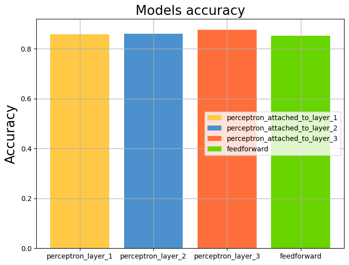
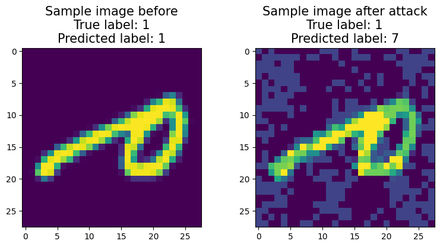
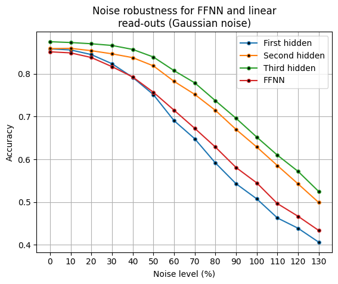
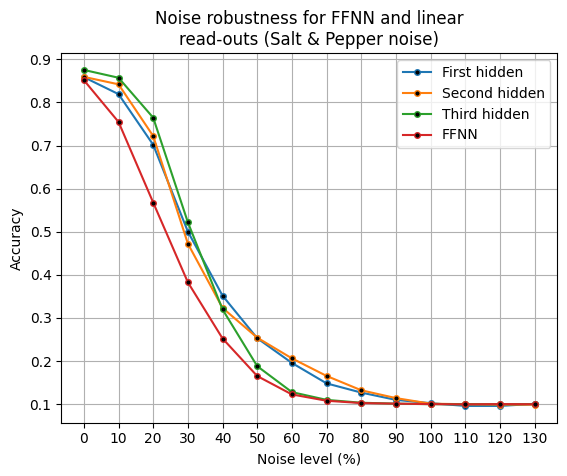
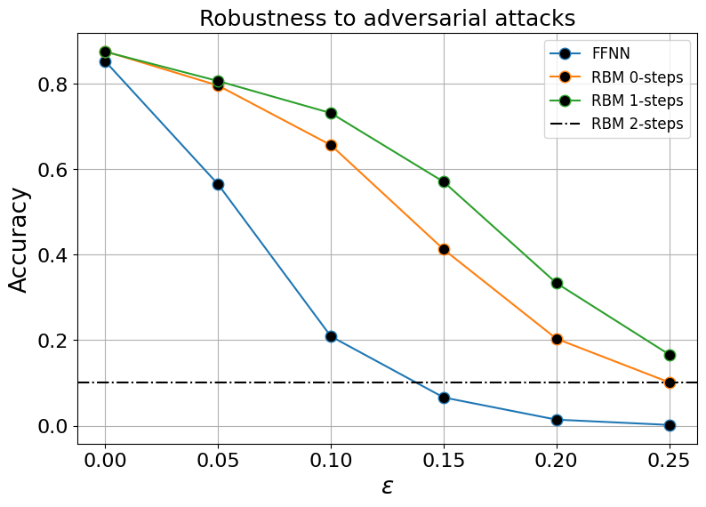

# cognition-and-computation

The objective of this project is to simulate and delve into the Deep Belief Networsk (DBN) to explore their effectiveness at visual concept learning.

To achieve this, the project employs clustering techniques and visualization methods to gain deeper insights into the extracted features.

Furthermore, these features are integrated into a feed-forward neural network layer to compare the network's accuracy when utilizing the features from the DBN against a perceptron network. This comparative analysis is done to assess the effectiveness of the features derived from the Deep Belief Network.

Finally, the project delves into its resilience when subjected to noise injection and adversarial attacks.

This analysis sheds light on the network's ability to maintain its performance under challenging conditions.

